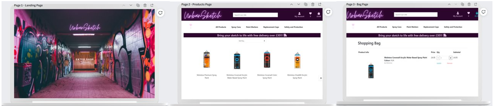
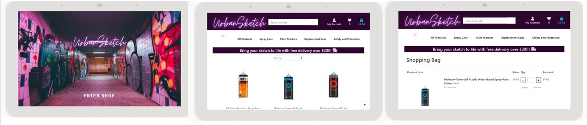
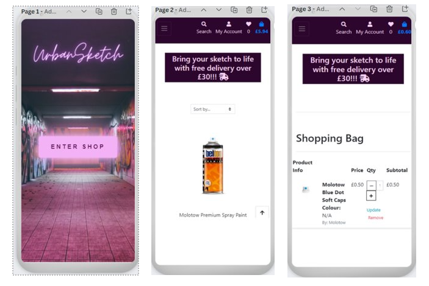
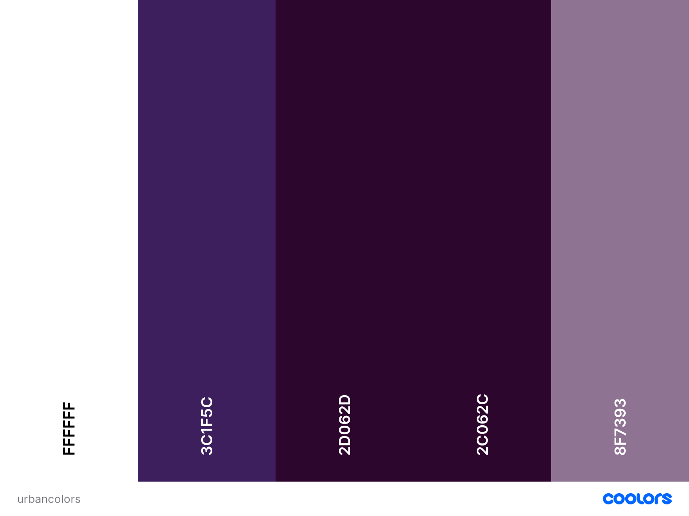
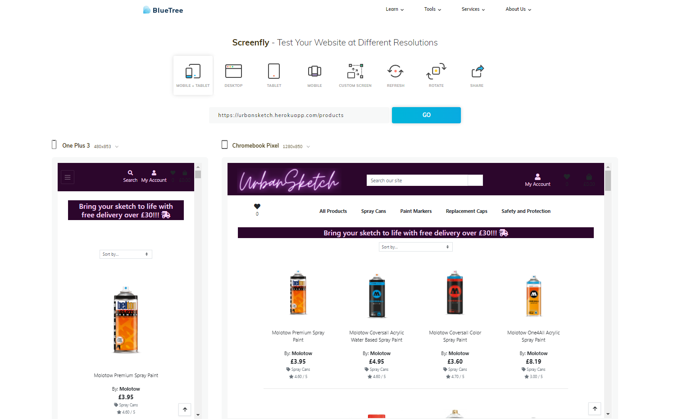
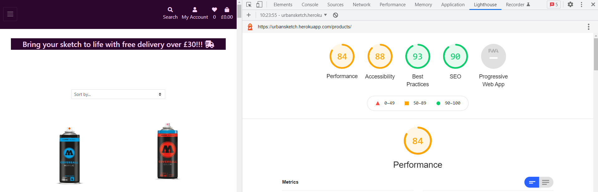
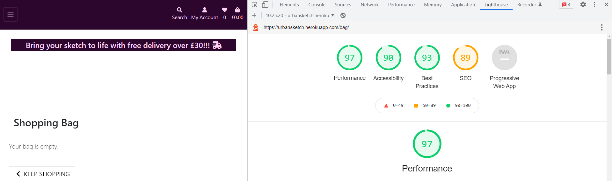
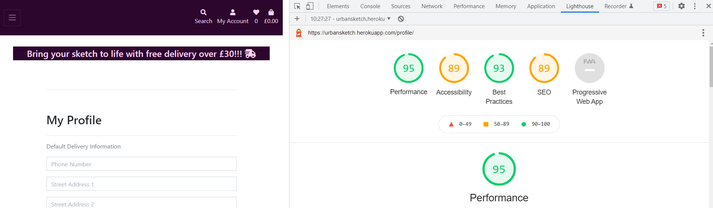
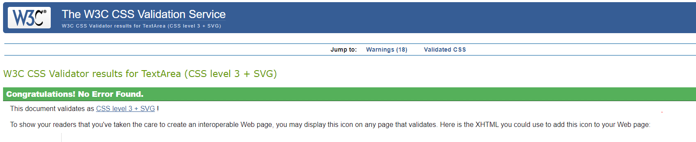
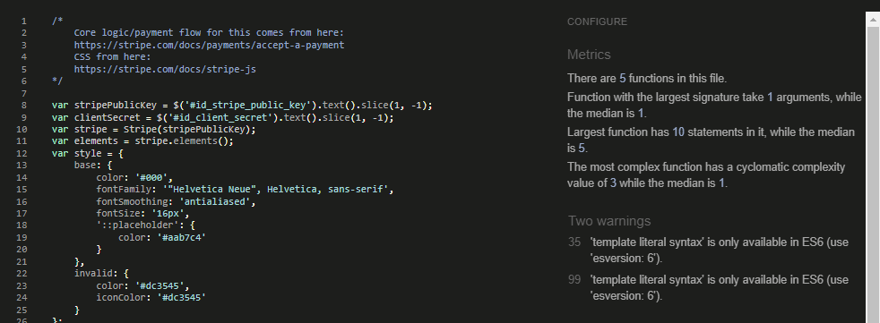

 

[View Live Site here](https://urbansketch.herokuapp.com) 

------
### Table of contents
- [Project Overview](#project-overview)
  * [Project Description](#project-description)
  * [Project Requirements](#project-requirements)
    + [Main Technologies](#main-technologies)
    + [Mandatory Requirements](#mandatory-requirements)
- [UX](#ux)
  * [Strategy](#strategy)
  * [User Stories](#user-stories)
- [Scope](#scope)
  * [Features](#features)
  * [Skeleton](#skeleton)
  * [Surface](#surface)
    + [Color Scheme](#color-scheme)
- [Technologies Used](#technologies-used)
  * [Languages](#languages)
  * [Frameworks, Libraries, Programs & Platforms Used:](#frameworks--libraries--programs---platforms-used-)
- [Deployment](#deployment)
  * [Deployment Steps](#deployment-steps)
  * [Project and Repository Creation](#project-and-repository-creation)
    + [Deployment Steps](#deployment-steps-1)
    + [Connect Heroku app to Github repository](#connect-heroku-app-to-github-repository)
    + [Add Heroku Postgres Database](#add-heroku-postgres-database)
    + [Setting up environment variables](#setting-up-environment-variables)
    + [Setting up the AWS s3 bucket](#setting-up-the-aws-s3-bucket)
    + [AWS IAM (Identity and Access Management) setup](#aws-iam--identity-and-access-management--setup)
    + [Connecting Heroku to AWS S3](#connecting-heroku-to-aws-s3)
    + [Enable automatic deployment:](#enable-automatic-deployment-)
  * [How to Fork the repository](#how-to-fork-the-repository)
  * [Making a Local Clone](#making-a-local-clone)
- [Testing](#testing)
  * [Code Validity](#code-validity)
  * [Testing User Stories](#testing-user-stories)
- [Credits](#credits)
- [Acknowledgements](#acknowledgements)
------
# Project Overview 
___ 
## Project Description   
**Code Institute: Full Stack Frameworks with Django - Milestone 4 Project**   
   
The Milestone 4 project assignment is to build a full-stack application based around business logic used to control a centrally-owned dataset.  To set up an authentication mechanism and provide paid access to the site's data and/or other activities based on the dataset, such as the purchase of a product. I have the option to choose from one of the following two scenarios or to come up with my own idea:   
. Build a fitness subscription application     
. Build a site to sell your graphic design services   
    
I have decided to create an eCommerce application for a fictional business called <strong>UrbanSketch</strong>. The business is a store that sells graffiti related products, such as spray cans, markers, caps and safety equipment.
   
## Project Requirements   
 
### Main Technologies   
. HTML, CSS, JavaScript, Python+Django    
  
. Relational database (recommending MySQL or Postgres)  
  
. Stripe payments    
  
. Additional libraries and APIs

### Mandatory Requirements       
1. Django Full Stack Project: Build a Django project backend by a relational database to create a website that allows users to store and manipulate data records about a particular domain.   
2. Multiple Apps: The project must be a brand new Django project, composed of multiple apps (an app for each potentially reusable component in your project).   
3. Data Modeling: Put some effort into designing a relational database schema well-suited for your domain. Make sure to put some thought into the relationships between entities. Create at least 2 custom django models beyond the examples shown on the course (changing the field names of the miniproject models is not customisation)   
4. User Authentication: The project should include an authentication mechanism, allowing a user to register and log in, and there should be a good reason as to why the users would need to do so. e.g., a user would have to register to persist their shopping cart between sessions (otherwise it would be lost).    
5. User Interaction: Include at least one form with validation that will allow users to create and edit models in the backend (in addition to the authentication mechanism).   
6. Use of Stripe: At least one of your Django apps should contain some e-commerce functionality using Stripe. This may be a shopping cart checkout or single payments, or donations, etc. After paying successfully, the user would then gain access to additional functionality/content on the site. Note that for this project you should use Stripe's test functionality, rather than actual live payments.   
7. Structure and Navigation: Incorporate a main navigation menu and structured layout (you might want to use Bootstrap to accomplish this).   
8. Use of JavaScript: The frontend should contain some JavaScript logic you have written to enhance the user experience.   
9. Documentation: Write a README.md file for your project that explains what the project does and the value that it provides to its users.   
10. Version Control: Use Git & GitHub for version control.   
11. Attribution: Maintain clear separation between code written by you and code from external sources (e.g. libraries or tutorials). Attribute any code from external sources to its source via comments above the code and (for larger dependencies) in the README.   
12. Deployment: Deploy the final version of your code to a hosting platform such as Heroku.    
13. Security: Make sure to not include any passwords or secret keys in the project repository. Make sure to turn off the Django DEBUG mode, which could expose secrets.   
        
# UX
___
## Strategy

* **Project Goals**
    * To create a fully functioning eCommerce site for UrbanSketch, an online business that sells graffiti supplies.  
    * To allow users to easily view, filter and search for any item available from this shop.  
    * To allow users to make a safe & secure purchase as conveniently as possible.  
    * To allow users to create a user profile to keep track of their order history, add items to their wishlist for a later order and to speed up the purchase process for future purchases.  

* **Business Goals**   
    * To offer their existing customers an alternative to instore shopping as an added convenience.  
    * To have a clean, fresh, modern, professional looking website that can be used as a marketing tool to highlight their range of products to potential new customers.
    * To increase their sales by reaching new customers from outside their immediate physical location.

* **Target audience**
    * The target audience are graffiti artists from the UK and not only.

## User Stories

* **As a first time user I want to be able to:**  

    * Clearly understand the purpose of the website.  
    * Easily navigate around the website. 
    * View all the products the website is selling. 
    * Find products by category. 
    * Filter products by price or alphabetical order.
    * Search for a specific product. 
    * View detailed information about each individual products on a separate page.
    * View my customer reviews of a particular product.  
    * Choose the colour, change the quantity and add a product to a shopping bag.
    * View a full list of items within the shopping bag with a breakdown of the individual costs.
    * View, update & remove products within my shopping bag. 
    * Easily see in the Navbar the current total of any items within the shopping basket.  
    * Securely checkout and purchase the products within my shopping basket. 
    * Receive an order confirmation on-screen and by email upon completion of my purchase.
    * Register and create a user profile.   
    * Contact the stores owners on social media if I have a query.

   
* **As a returning user I want to be able to:**  
    * Login and out of the website with ease. 
    * View my user profile. 
    * Save default delivery details in order to speed up future purchases.   
    * Update my default delivery details.  
    * View my order history.
    * Add products to a wishlist so I can purchase them at a later date.  
    * Write reviews for products I have used for other users to view. 
  
* **As the site owner I want:**
    * Customers to be able to view the full list of products available for purchase.  
    * Customers to be able to filter products by category, price or alphabetical order.  
    * Customers to be able to select and purchase products as quick & easily as possible.  
    * Customers to be able to add, edit, update or delete products within their shopping basket.
    * Customers to be able to read product reviews prior to making a purchase.  
    * Customers to be able to write product reviews after making a purchase. 
    * To be able to maintain & update the website via an Admin panel.  
    * To be able to add, edit, update or delete products from the website.

# Scope  
------  

## Features  

* A Navigation bar to guide the user experience across the website; 
* A search box within the Navbar for a quick search option; 
* Products divided into categories;  
* Ability to filter products by Price, Brand or Rating;  
* An option to create a User Profile;
* An option to add products to a user wishlist;  
* An option to add product reviews;  

## Skeleton
------  
   
*  __Desktop Wireframe__
  
  
*  __Tablet Wireframe__
  
    
*  __Mobile Wireframe__


## Surface 
-----
### Color Scheme  
  
I have chosen a different shades of purple to match the colour from the graffiti background image on the landing page. Purple is also a vibrant stand out colour which is ideal for an activity such a graffiti.  
  
For the color palette I used [Coolors](https://coolors.co/).  

# Technologies Used  
------  
## Languages  
-  [__HTML5__](https://en.wikipedia.org/wiki/HTML5)

*  [__CSS3__](https://en.wikipedia.org/wiki/Cascading_Style_Sheets)  
 
-  [__Javascript__](https://en.wikipedia.org/wiki/JavaScript)  
  
-  [__Python__](https://en.wikipedia.org/wiki/Python_(programming_language))  

## Frameworks, Libraries, Programs & Platforms Used:   

* [__Django 3.2__](https://www.djangoproject.com/) This was the main framework used to build the app. 
  - Django extensions used  
     * [Django Allauth](https://django-allauth.readthedocs.io/en/latest/)  
     * [Django Countries](https://pypi.org/project/django-countries/)  
     * [Django Crispy Forms](https://django-crispy-forms.readthedocs.io/en/latest/)  
     * [Django-Storages](https://django-storages.readthedocs.io/en/latest/)  
* [__jquery 3.6.0__](https://blog.jquery.com/) Javascript framework used to create some of the site's interactive functions.  
* [__Bootstrap 4__](https://getbootstrap.com/docs/4.1/getting-started/introduction/) Bootstrap Grid was used for responsiveness as well as features such as accordion.  
* [__Jinja__](https://jinja.palletsprojects.com/en/3.0.x/templates/) Was used to create the Python templates.   
* [__Heroku__](https://heroku.com/) The cloud platform for deploying the app.  
* [__SQlite3__](https://www.sqlite.org/index.html) The database used for development.  
* [__Heroku Postgres__](https://www.heroku.com/postgres/) PostgreSQL is the database used for the production site. 
* [__Stripe__](https://stripe.com/ie) Online payment system.
* [__AWS-S3__](https://aws.amazon.com/s3/) Amazon Object storage service.  
* [__VS Code__](https://code.visualstudio.com/download) VS Code was the IDE used to create the site and for version control.  
* [__Github__](https://github.com/) GitHub is used to store the projects code after being pushed from Gitpod.  
* [__Canva__](https://canva.com) Canva was used to create wireframes during the design process and for the Urban Sketch logo.
* [__Django Secret Key Generator__](https://miniwebtool.com/django-secret-key-generator/) to generate the required key.   
* [__Fontawesome__](https://fontawesome.com) Font Awesome was used for the Icons throughout the site.  
* [__coolors.co__](https://coolors.co/384364-ffd2b0-f6f7eb-cccccc-333333) used for colour palette selection.   
* Mozilla DevTools used for debugging and testing.  
* Google DevTools used for debugging and testing.  
* [__W3Scool__](https://www.w3schools.com/) used as a general source of information.  
* [__Unsplash__](https://unsplash.com/) used to download the background image for the index page.  
* [__Stackoverflow__](https://stackoverflow.com/) used as one of my main sources of information.  
* [__W3C Markup Validator__](https://validator.w3.org/) Used to test HTML code validation.  
* [__W3C CSS Validatior - Jigsaw__](https://jigsaw.w3.org/css-validator/) Used to test CSS code validation.  
* [__Jshint Validatior__](https://jshint.com/) Used to test Javascript / JQuery code validation.
* [__PEP8 Validatior__](http://pep8online.com/) Used to test that Python code is PEP8 compliant.
* [__BlueTree Screenfly__](https://bluetree.ai/) used to check if code is Mobile Friendly.  
* [__Techsini__](https://techsini.com/) used to create Mock-up images to represent the site's responsiveness.  

# Deployment  
------  
  
## Deployment Steps  
  
This project was built using VSCode and pushed to Github using the terminal interface. However, as Github can only host static websites the project had to be deployed to Heroku as it is compatible for hosting a back-end focused site.    
    
## Project and Repository Creation  
 1. Navigate to [Github](https://github.com).  
 2. Create a new repository by first clicking the green button labeled new on the top left of the screen.  
 3. Select the Code Institute template in the templates section.  
 4. Name the repository i.e. UrbanSketch.  
 5. Click the green 'Create Repository' button at the bottom of the page.  
 6. Inside your IDE i.e. VS Code open the newly created repository.   
 7. Use the git add . command to add all modified and new files to the staging area.  
 8. Use the git commit -m command to commit a change to the local repository.  
 9. Use the git push command to push all committed changes to github.  
   
Before deploying the website to Heroku, the following three must be followed to allow the app to work in Heroku:

 1. Create requirements.txt file that contains the names of packages being used in Python. It is important to update this file if other packages or modules are installed during project development by using the following command:  
  
    -pip install -r requirements.txt  

 2. Create Procfile that contains the name of the application file so that Heroku knows what to run. If the Procfile has a blank line when it is created remove this as this may cause problems.  
  
 3. Push these files to GitHub.  
  
 4. Install psycopg2 and dj_datatbase_url in your workspace cli.  
  
Once those steps are done, the website can be deployed in Heroku using the steps listed below:  
  
### Deployment Steps  
 1. Log into Heroku .  
 2. Click the New button.  
 3. Click the option to create a new app.  
 4. Enter the app name in lowercase letters.  
 5. Select the correct geographical region.  
   
### Connect Heroku app to Github repository  
 1. In heroku select the deploy tab.  
 2. Click github button.  
 3. Enter the repository name and click search.  
 4. Select the relevant repository and click connect.  
  
### Add Heroku Postgres Database  
 1. Click the resources tab in heroku.  
 2. Under Add-ons search for heroku postgres.  
 3. Click on heroku postgres when it appears.  
 4. Select the Hobby Dev-Free option in plans.  
 5. Click submit order form.  
  
### Setting up environment variables   
 1. In the heroku settings click the reveal config vars button and set the following variables:   
   - SECRET_KEY   
   - DATABASE_URL  
   - AWS_ACCESS_KEY_ID  
   - AWS_SECRET_ACCESS_KEY  
   - USE_AWS  
   - STRIPE_PUBLIC_KEY  
   - STRIPE_SECRET_KEY  
   - STRIPE_WH_SECRET  
   - EMAIL_HOST_PASSWORD  
   - EMAIL_HOST_USER  
* The values of all these have been kept secret in keeping with best security practices.
    
* I used miniwebtool's [Django Secret Key Generator](https://miniwebtool.com/django-secret-key-generator/) to generate the required key.  
   
### Setting up the AWS s3 bucket  
 1. Create an Amazon AWS account  
 2. Search for S3 and create a new bucket  
    * Allow public access  
 3. Under Properties > Static website hosting  
    * Enable  
    * index.html as index.html  
    * save  
 4. Under Permissions > CORS use the following:  
[  
  {  
      "AllowedHeaders": [  
          "Authorization"  
      ],  
      "AllowedMethods": [  
          "GET"  
      ],  
      "AllowedOrigins": [  
          "*"  
      ],  
      "ExposeHeaders": []  
  }  
]    
  
  5. Under Permissions > Bucket Policy:  
     * Generate Bucket Policy and take note of Bucket ARN  
     * Chose S3 Bucket Policy as Type of Policy  
     * For Principal, enter *  
     * Enter ARN noted above  
     * Add Statement  
     * Generate Policy  
     * Copy Policy JSON Document  
     * Paste policy into Edit Bucket policy on the previous tab  
     * Save changes  
  6. Under Access Control List (ACL):  
     * For Everyone (public access), tick List  
     * Accept that everyone in the world may access the Bucket  
     * Save changes  

### AWS IAM (Identity and Access Management) setup  
  
 1. From the IAM dashboard within AWS, select User Groups:  
    * Create a new group
    * Click through and Create Group  
      
 2. Select Policies:  
    * Create policy  
    * Under JSON tab, click Import managed policy  
    * Choose AmazongS3FullAccess  
    * Edit the resource to include the Bucket ARN noted earlier when creating the Bucket Policy  
    * Click next step and go to Review policy  
    * Give the policy a name and description of your choice  
    * Create policy  
      
 3. Go back to User Groups and choose the group created earlier  
    * Under Permissions > Add permissions, choose Attach Policies and select the one just created   
    *   Add permissions 
  
 4. Under Users:  
    * Choose a user name  
    * Select Programmatic access as the Access type  
    * Click Next  
    * Add the user to the Group just created  
    * Click Next and Create User  
  
    
 5. Download the .csv containing the access key and secret access key.  
    * THE .csv FILE IS ONLY AVAILABLE ONCE AND CANNOT BE DOWNLOADED AGAIN. (so I suggest you save a copy in a secure location)  
  
### Connecting Heroku to AWS S3  

 1. Install boto3 and django-storages  
    * pip3 install boto3    
    * pip3 install django-storages  
    * pip3 freeze > requirements.txt  
 2. Add the values from the .csv you downloaded to your Heroku Config Vars under Settings:  
 3. Delete the DISABLE_COLLECTSTATIC variable from your Cvars and deploy your Heroku app  
 4.   With your S3 bucket now set up, you can create a new folder called media (at the same level as the newly added static folder) and upload any required media files to it.  
    * PLEASE MAKE SURE media AND static FILES ARE PUBLICLY ACCESSIBLE UNDER PERMISSIONS
  
### Enable automatic deployment:  
 1. Click the Deploy tab  
 2. In the Automatic deploys section, choose the branch you want to deploy from then click Enable Automation Deploys.  

## How to Fork the repository  
  
By forking the GitHub Repository you make a copy of the original repository on your own GitHub account to view and/or make changes without affecting the original repository by following these simple steps:  
  
1. Log in to GitHub and locate the [cosminaserbanica/CI-MS4-UrbanSketch Repository](https://github.com/cosminaserbanica/CI-MS4-UrbanSketch)   
2. Near the top of the Repository, on the right-hand side of the screen, locate the "Fork" button.  
3. Click this button and you should now have a copy of the original repository in your GitHub account.  
    
## Making a Local Clone 
  
1. Log in to GitHub and locate the [cosminaserbanica/CI-MS4-UrbanSketch Repository](https://github.com/cosminaserbanica/CI-MS4-UrbanSketch)  
2. Under the repository name, click "Clone or download".  
3. To clone the repository using HTTPS, under "Clone with HTTPS", copy the link.  
4. Open Git Bash  
5. Change the current working directory to the location where you want the cloned directory to be made.  
6. Type `git clone`, and then paste the URL you copied in Step 3.  
```  
$ git clone CI-MS4-UrbanSketch  
```  
7. Press Enter. Your local clone will be created.  
```  
$ git clone https://github.com/cosminaserbanica/CI-MS4-UrbanSketch  
> Cloning into `CI-Clone`...  
> remote: Counting objects: 10, done.  
> remote: Compressing objects: 100% (8/8), done.  
> remove: Total 10 (delta 1), reused 10 (delta 1)  
> Unpacking objects: 100% (10/10), done.  
```   
  
Once the project been loaded into the IDE it is necessary to install the necessary requirements which can be done by typing the following command.  
  
    -pip install -r requirements.txt    
  
It is important to note that this project will not run locally unless a `.env` file (or similar method) has been set up by the user which contains all of the following details, which have all been kept secret in keeping with best security practices:-  
   - SECRET_KEY=   
   - DATABASE_URL=  
   - AWS_ACCESS_KEY_ID=  
   - AWS_SECRET_ACCESS_KEY=  
   - USE_AWS=True  
   - STRIPE_PUBLIC_KEY=  
   - STRIPE_SECRET_KEY=  
   - STRIPE_WH_SECRET=  
   - EMAIL_HOST_PASSWORD=  
   - EMAIL_HOST_USER=    

# Testing  
------  
## Code Validity
- Mobile Friendly

    

- Lighthouse

  
  


- CSS

 

- JS



## Testing User Stories  

* **As a first time user I want to be able to:**  

  * Clearly understand the purpose of the website.
      - The landing/index page contains an image with graffiti.  
      - The brandname `UrbanSketch` is prominently featured in the top left-hand corner of the Navbar.  
      - The Navbar contain the main category names which make it clear that the site sells graffiti related items. 
  * Easily navigate around the website.  
      - There is a fixed Navbar across the top of the site.  
      - The main category names are displayed across the centre of the Navbar.  
      - There is a Search Box in the centre of the Navbar.
  * View all the products the website is selling.  
      - The Navbar contains a prominent link to `All Products`.  
  * Filter products by category.
      - The user can also search for a category or product by name in the search bar.
  * Filter products by price or alphabetical order.  
      - Under the the navbar the user can filter by Price, Rating & Brand.
  * Search for a specific product. 
      - There is a search box in the Navbar for this purpose.  
  * View detailed information about each individual products on a separate page. 
      - The product_detail.html page provides this feature.    
  * Choose the colour, change the quantity and add a product to a shopping basket.  
      - The product_detail.html page provides this feature.    
  * View a full list of items within the shopping basket with a breakdown of the individual costs.
      - The checkout page provides this feature.   
  * View, update & remove products within my shopping basket. 
      - The checkout page provides this feature.   
  * Easily see in the Navbar the current total of any items within the shopping basket. 
      - There is a shopping basket icon in the top right of the Navbar which gives the current total cost.       
  * Securely checkout and purchase the products within my shopping basket.  
      - The checkout page provides this feature.   
  * Receive an order confirmation on-screen and by email upon completion of my purchase.  
      - Yes both on-screen and email confirmation is provided to the user.   
  * Register and create a user profile.   
      - Available via the main Navbar depending on whether the user is logged in or not.  
  * Contact the stores owners on social media if I have a query.  
      - This feature has been provided on the footer available on all products page.    

 
   
* **As a returning user I want to be able to:** 

    * Login and out of the website with ease.  
      - This feature is provide in the top right of the Navbar.      
    * View my user profile.  
      - The user profile page can be accessed via the Navbar.     
    * Save default delivery details in order to speed up future purchases.   
      - The user profile page provides this feature.     
    * Update my default delivery details.  
      - The user profile page provides this feature.    
    * View my order history. 
      - The user profile page provides this feature.  
    * Add items to wishlist. 
    - The user can add items to a wishlist for future buy.
    * Write product reviews. 
  - The user can write product reviews for other users to read.
    
* **As the site owner I want:**

    * Customers to be able to view the full list of products available for purchase.  
      - This feature is provide via the products.html page.      
    * Customers to be able to filter products by category, price or alphabetical order.  
      - This feature is provided under the navbar.     
    * Customers to be able to select and purchase products as quick & easily as possible.  
      - There is an option to quickly buy without registration.       
    * Customers to be able to add, edit, update or delete products within their shopping basket.  
      - This feature is provided via the Checkout page.     
    * Customers to be able to read product reviews prior to making a purchase.  
      - This feature is provide via the Reviews page which is linked to from the product_detail.html page.     
    * Customers to be able to write product reviews after making a purchase.  
      - Users must be registered users and logged into the site before they can create a product review but in the next release of the site steps will be taken to restrict the creation of reviews to those users who have actually purchased a specific item.     
    * To be able to maintain & update the website via an Admin panel.  
      - This feature is provide for the Admin/Superuser.     
    * To be able to add, edit, update or delete products from the website.  
      - This feature is provide for the Admin/Superuser.     
    * To be able to add, edit, update or delete blog posts from the website 
      - This feature is provide for the Admin/Superuser.     

# Credits  
------  
* The [Code Institute Boutique Ado Mini Project](https://github.com/Code-Institute-Solutions/boutique_ado_v1) was used as a reference point for the developer in the development of the core functionality of the website. The lessons included with the mini-project helped the developer to get a better understanding of each functionality and how to customise it to suit their project.
* The [Fellow student StephenJ2020/Sportmaster](https://github.com/StephenJ2020/Sportmaster) was used as a reference point for the developer in the development of the core functionality of the product reviews app.
* [Graff City website](https://www.graff-city.com/) was used to download product images used in the Urban Sketch project.

# Acknowledgements  
------  
*  I would like to thank my mentor Brian Macharia for his valuable advice and constant support throughout my learning.  
*  The wonderful Code Institute Tutor Support team.
* My fellow Code Institute students [Stephen](https://github.com/StephenJ2020) and [Rebecca](https://github.com/rebeccatraceyt) for inspiring me to be as good as I could be.